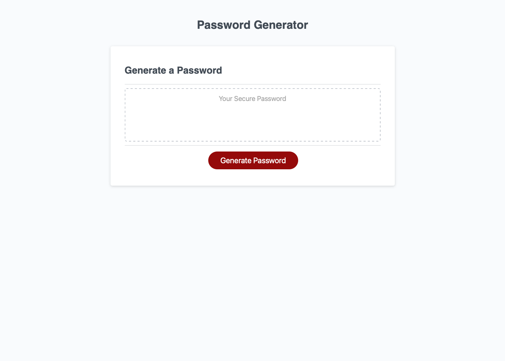

# Secure Password Generator
## Project Description
Description: A password is randomly generated based on set criteria that the user provides when prompted via js alerts/prompts. 

When the user clicks the button "Generate Password" they are first promoted for password length. If outside the range of 8-50, the user is prompted to once again enter a password lengthw within the range. The prompt will loop until the user enters a valid number. 

The program then prompts the user to define if they would like to include numbers, characters, uppercase and/or lowercase letters. 

If the user selects none to all criteria, the program will ask it to select at least each one and will loop back through the prompts.

When all parameters have been defined, the password will appear within the password box. 

The generated password can be copied to the clipboard by pressing a button at the bottom of the screen.

## Contents
1. [Deployed Page](#deployed-page)
2. [Contributions](#contributions)

## Deployed Page

[Deployed GitPage](https://michaeladamgroberman.github.io/Password-Generator/)

## Contributions
* Code refactoring completed by Michael Groberman